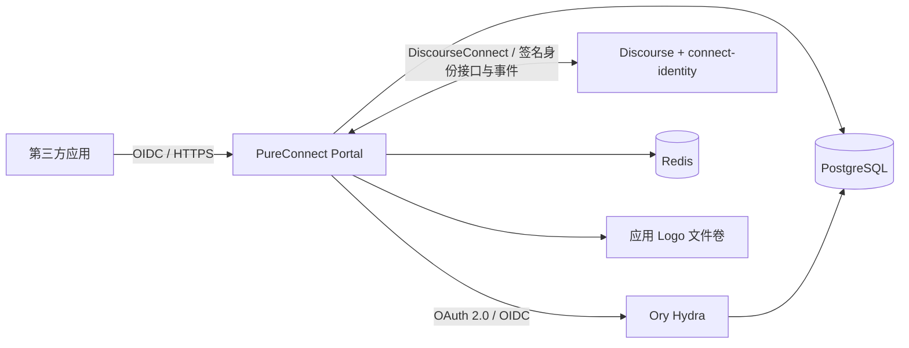

# PureConnect

**为 Discourse 社区提供可自托管的 OpenID Connect 身份认证平台。**

PureConnect 将 Discourse 账号接入标准 OIDC 登录流程，让社区成员使用已有账号登录第三方应用。Discourse 继续管理账号、密码、二步验证和账号状态；PureConnect 负责应用管理、用户授权、身份映射和审计，Ory Hydra 负责 OAuth 2.0 / OIDC 协议处理。

[接入指南](docs/integration-guide.md) · [部署与运维](docs/operator-runbook.md) · [Discourse 插件](discourse-plugin/connect-identity/README.md) · [反馈问题](https://github.com/puremixai/pureconnect/issues) · [MIT License](LICENSE)

此次更名调整项目品牌与仓库名称。为保持现有部署兼容，Go module 仍为 `connect.xai.run`，Docker Compose project 仍为 `xai-connect`，运行配置及 Go 联调示例继续使用 `CONNECT_*` 环境变量；已有数据卷、插件设置和部署配置标识保持不变。现有部署无需随品牌更名调整这些标识，以免创建新的数据卷或中断接入。已部署实例的域名、OIDC Issuer 和已注册回调地址也不受品牌更名影响。

## 功能

- **社区账号登录**：通过 DiscourseConnect 登录，使用签名接口与事件同步账号状态。
- **OIDC 接入**：支持 Discovery、Authorization Code、PKCE（S256）、UserInfo、JWKS、Token 刷新和撤销。
- **应用管理**：创建和编辑应用、登记回调地址、上传 Logo、查看和轮换 Client Secret、撤销应用。
- **授权与权限**：按 Scope 提供用户资料，默认强制校验 PKCE + nonce，支持按应用设置兼容策略。
- **社区管理**：提供审核队列、管理员运营概览和用户信任等级进度；审核与管理权限来自 Discourse 群组。
- **持久化与部署**：使用 PostgreSQL、Redis 和文件卷保存数据，提供 Docker Compose、Nginx 配置示例及健康检查。

当前应用提交后默认自动创建 OIDC Client；审核队列可处理历史或特殊的待审核应用。第三方接入方只使用 Client 凭证与 OIDC Token，无需获取 Discourse 密码、Cookie 或 API Key。

## 适用场景

- 为自己的 Discourse 社区部署统一登录入口。
- 让社区工具、内容服务或内部 Web 应用支持“使用社区账号登录”。
- 基于用户授权，读取昵称、头像、邮箱或社区信任等级。

当前支持能够安全保存 Client Secret 的**服务端 Web 应用**。SPA、移动端和桌面客户端需要通过自己的后端/BFF 完成 Token Exchange。回调地址必须是精确的 HTTPS 域名地址，不支持 HTTP、localhost、IP、通配符、查询参数或片段。

仅接入现有 PureConnect 实例的开发者，可直接阅读[第三方项目接入指南](docs/integration-guide.md)。自托管使用自己的域名与 Discourse 站点，不需要接入 `xai.run`。

## 架构



| 组件 | 技术与职责 |
| --- | --- |
| Portal | Go 1.25+、`net/http`、Go HTML 模板；登录、应用、授权、审核与管理页面 |
| Ory Hydra | Compose 固定为 `v26.2.0`；OAuth 2.0 / OIDC 协议服务 |
| PostgreSQL | Compose 使用 16；身份映射、应用、授权、审计、后台任务与 Hydra 数据 |
| Redis | Compose 使用 7；Session、nonce 防重放和等级进度缓存 |
| Discourse 插件 | Ruby；提供签名身份接口、账号状态事件与等级进度 |
| 反向代理 | 通过 HTTPS 将公开请求转发至 Portal |

Compose 包含 Portal、Hydra、数据库和 Redis。Discourse、HTTPS 反向代理与证书需要单独准备。

## 自托管快速开始

以下命令在仓库根目录执行；文件复制命令使用 PowerShell。

### 1. 准备环境

- Git、Docker Engine / Docker Desktop 和 Docker Compose v2。
- 可安装自定义插件的 Discourse 站点，以及站点管理权限。
- 独立的 PureConnect 域名、HTTPS 证书和反向代理。
- 为 PureConnect 域名配置的 Cloudflare Turnstile Site Key 与 Secret；当前服务启动需要这两项。

### 2. 获取源码

```powershell
git clone https://github.com/puremixai/pureconnect.git
cd pureconnect
Copy-Item .env.example .env
```

使用 SSH 时，仓库地址为 `git@github.com:puremixai/pureconnect.git`。

### 3. 配置环境变量

编辑 `.env`，将示例域名替换为自己的域名，为各项密钥生成独立随机值。

| 变量 | 配置说明 |
| --- | --- |
| `CONNECT_HOST` | PureConnect 域名，例如 `connect.example.com`，不带协议或路径 |
| `DISCOURSE_URL` | Discourse HTTPS 地址，例如 `https://forum.example.com` |
| `DISCOURSE_SHARED_SECRET` | 与 Discourse 插件及 DiscourseConnect Provider 共用的签名密钥 |
| `POSTGRES_DB` / `POSTGRES_USER` | 数据库名称和用户，默认均为 `connect` |
| `POSTGRES_PASSWORD` | 数据库密码；Compose 会将其插入连接 URL，可使用随机十六进制值避免 URL 特殊字符问题 |
| `CONNECT_ENCRYPTION_KEY` | 解码后恰好 32 字节的密钥，支持 Base64 或十六进制，用于加密 Client Secret |
| `TURNSTILE_SITE_KEY` / `TURNSTILE_SECRET` | 自己的 Turnstile 站点凭证；示例 Site Key 也需要替换 |
| `TURNSTILE_HOSTNAMES` | Turnstile 允许的 PureConnect 主机名；生产环境仅配置自己的前端域名 |
| `HYDRA_SYSTEM_SECRET` / `HYDRA_COOKIE_SECRET` / `HYDRA_PAIRWISE_SALT` | 分别生成独立的高熵随机值 |
| `PORTAL_PORT` / `HYDRA_PUBLIC_PORT` | 宿主机回环端口，默认 `8080` / `4444` |

完整模板见 [`.env.example`](.env.example)。`.env` 已加入 Git 忽略规则；加密密钥需要在数据库之外单独备份。

### 4. 配置 Discourse

将 [`discourse-plugin/connect-identity`](discourse-plugin/connect-identity) 安装为 Discourse 的 `plugins/connect-identity`，并配置：

| Discourse 设置 | 值 |
| --- | --- |
| `connect_identity_enabled` | `true` |
| `connect_identity_base_url` | `https://connect.example.com` |
| `connect_identity_shared_secret` | 与 `.env` 的 `DISCOURSE_SHARED_SECRET` 一致 |
| `enable_discourse_connect_provider` | `true` |
| `discourse_connect_provider_secrets` | 包含 `connect.example.com\|同一共享密钥` |
| `discourse_connect_allowed_redirect_domains` | 包含 `connect.example.com` |

首次完成插件配置后重启或重建 Discourse，使插件路由和事件钩子加载。仓库根目录不是 Discourse 插件目录，安装时应使用上述子目录；容器部署需确保重建后插件仍然存在。

按需创建 `connect-reviewers`、`connect-admins` 群组并加入成员。插件设置、权限规则和账号维护见[运维手册](docs/operator-runbook.md)。

### 5. 构建并启动

```powershell
./scripts/check-compose.ps1
docker compose --env-file .env -f deploy/docker-compose.yml config --quiet
docker compose --env-file .env -f deploy/docker-compose.yml up -d --build
docker compose --env-file .env -f deploy/docker-compose.yml ps
docker compose --env-file .env -f deploy/docker-compose.yml exec portal /connect healthcheck
```

Compose 会等待 PostgreSQL 和 Redis 就绪，并在 Hydra 启动前执行 Hydra 数据库迁移。Portal 的 SQL 文件只会在 PostgreSQL **首次初始化空数据卷**时自动执行；已有数据库升级须按顺序应用尚未执行的迁移，详见[运维手册](docs/operator-runbook.md)。

### 6. 配置 HTTPS 并验证

参考 [`deploy/nginx.connect.xai.run.conf`](deploy/nginx.connect.xai.run.conf)，替换 `server_name`、证书路径和上游地址：

- Nginx 运行在宿主机：上游使用 `http://127.0.0.1:8080`，端口与 `PORTAL_PORT` 一致。
- Nginx 与 Portal 位于同一 Docker 网络：上游可使用 `http://portal:8080`。
- 示例中的 `xai-connect-portal-1` 是特定容器名，需按实际网络调整；所有公开协议请求均转发至 Portal。

对外提供 HTTPS 服务，Hydra Admin `4445` 保持内部可达。配置完成后访问：

```text
https://connect.example.com/
https://connect.example.com/readyz
https://connect.example.com/.well-known/openid-configuration
```

`/healthz` 检查进程存活，`/readyz` 检查 PostgreSQL 与 Redis。随后用一个测试应用走完 Discourse 登录、用户授权、换 Token 与 UserInfo 流程，确认完整链路。

## 接入你的应用

1. 登录部署好的 Portal，在“我的应用”登记应用与精确 HTTPS 回调地址。
2. 等待状态变为 `approved`，获取 Client ID，并在近期敏感操作确认后查看 Client Secret。
3. 使用 OIDC 客户端库读取 `https://你的-PureConnect-域名/.well-known/openid-configuration`。
4. 通过 Authorization Code + PKCE（S256）发起登录；回调时先校验 `state`，再在服务端以 `client_secret_basic` 换取 Token。
5. 校验 ID Token 签名、`iss`、`aud`、时间和 `nonce`，使用 `(issuer, sub)` 关联本地账号。

| Scope | 返回内容 |
| --- | --- |
| `openid` | `sub` |
| `profile` | `preferred_username`、`name`、`picture` |
| `email` | `email` |
| `community` | `trust_level`、`active`、`silenced` |
| `offline_access` | 获批后可获取 Refresh Token |

从 `openid profile` 开始，按业务需要追加 Scope。Access Token 为不透明 Token；用户资料以实际获批 Scope 为准。

完整流程、错误处理、刷新和撤销说明见[接入指南](docs/integration-guide.md)，命令行联调工具见 [`examples/go-client/main.go`](examples/go-client/main.go)。该示例用于理解协议，不包含完整的生产 Session 管理和 ID Token 校验。

## 开发与验证

安装 Go 1.25 或更新版本后，在仓库根目录执行：

```powershell
go mod download
go test ./...
go vet ./...
go build ./cmd/connect
./scripts/check-compose.ps1
```

项目使用 Go 模板和静态资源，不需要单独安装 Node.js 或构建前端。安装了 Make 的环境也可使用 `make test`、`make lint` 和 `make build`。

直接执行 `go run ./cmd/connect` 前，需要准备真实依赖并设置进程环境变量。Go 程序不会自动读取 `.env`；Compose 会将模板变量转换为 `CONNECT_ISSUER_URL`、`POSTGRES_DSN`、`REDIS_URL` 等运行配置，完整定义见 [`internal/config/config.go`](internal/config/config.go)。

Discourse 插件测试需要在已安装插件的 Discourse 环境中运行：

```bash
bundle exec rspec plugins/connect-identity/spec
```

## 项目结构

```text
pureconnect/
├── cmd/connect/                  # Portal 服务入口
├── internal/                     # 应用、身份、OIDC、存储和 Web 页面
├── discourse-plugin/connect-identity/  # Discourse 身份桥接插件
├── migrations/                   # Portal 数据库迁移
├── deploy/                       # Docker Compose 与 Nginx 示例
├── docs/                         # 接入指南、运维手册与设计记录
├── examples/go-client/           # Go OIDC 命令行联调示例
├── scripts/                      # Compose 检查和部署辅助脚本
├── .env.example                  # Compose 环境变量模板
└── Dockerfile                    # Portal 镜像构建
```

## 当前边界

- 当前客户端契约为机密 Web 客户端，不支持公共客户端注册或 `client_credentials`。PKCE + nonce 默认开启；兼容开关不改变服务端保管 Secret 的要求。
- 自托管域名可配置，部分论坛链接和示例仍指向原实例的 `xai.run` 域名。用于其他社区时，需检查 [`internal/web/templates`](internal/web/templates) 中的展示内容。
- DiscourseConnect 待完成登录状态保存在 Portal 进程内；多副本部署需要额外设计登录状态共享，进程重启后进行中的登录可能需要重新发起。
- 确保应用资源卷或挂载目录对容器的 `nonroot` 用户可写。备份和升级步骤见[运维手册](docs/operator-runbook.md)。
- `scripts/deploy.ps1` 保留了原实例的部署默认值。用于自己的服务器前，需显式设置目标主机、用户、目录和 SSH 密钥；初次部署请从上述 Compose 流程开始。

## 参与贡献

欢迎提交 Bug 报告、文档改进和 Pull Request。

1. 在 [Issues](https://github.com/puremixai/pureconnect/issues) 搜索已有问题；新问题请附复现步骤、预期行为、实际结果和相关版本。
2. Fork 仓库并创建分支，保持一次改动聚焦一个问题。
3. 行为变更应补充相应测试；提交 PR 前运行上面的 Go 测试、静态检查和构建，涉及插件时运行插件测试。
4. 在 [Pull Request](https://github.com/puremixai/pureconnect/pulls) 中说明改动目的、验证方式，以及配置或迁移影响。

日志、截图和示例配置请先脱敏，不要提交真实凭证、Token 或用户资料。安全问题请先通过 GitHub 提供的私密漏洞报告入口联系维护者（如已启用），避免在公开 Issue 中披露可利用细节。

## 许可证

本项目采用 [MIT License](LICENSE)。第三方依赖遵循各自的许可证。
