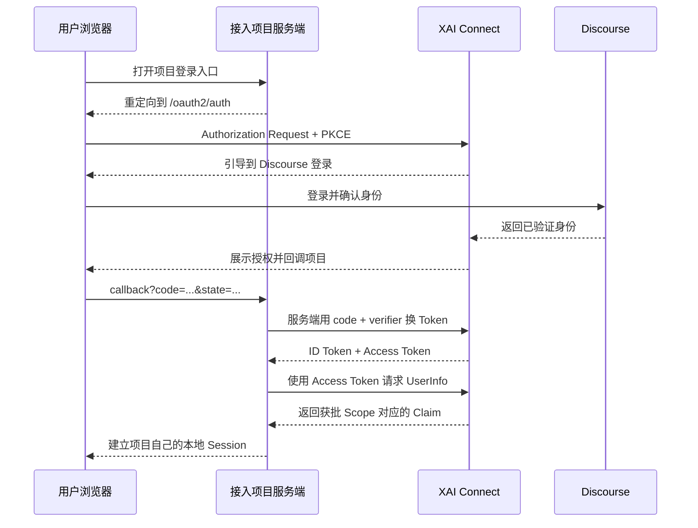

# XAI Connect 第三方项目接入指南

本文面向需要使用 XAI Connect 登录的第三方项目开发者，说明如何将一个有服务端的 Web 应用接入 XAI Connect。

XAI Connect 对外提供 OpenID Connect（OIDC）登录接口。用户账号、密码、二步验证和账号状态仍由 Discourse 管理；接入方只接收标准 OIDC Token 和用户 Claim，不需要接触 Discourse Cookie、API Key 或密码。

本文使用以下生产 Issuer：

```text
https://connect.xai.run
```

接入协议固定为：

```text
OIDC Authorization Code + PKCE（S256）+ client_secret_basic
```

## 1. 先确认项目是否适合接入

### 1.1 可以直接接入

项目必须同时满足以下条件：

- 有可信服务端，可以安全保存 Client Secret；
- 可以在服务端保存一次性 `state`、`nonce` 和 `code_verifier`；
- 可以提供一个公网可访问的精确 HTTPS 回调地址；
- 使用服务端 Session，或能在服务端安全管理自己的登录状态。

常见的服务端渲染应用、前后端分离应用的 BFF、传统 MVC 应用都适合直接接入。

### 1.2 不能直接接入

以下项目不能直接把 XAI Connect 当作公共客户端使用：

- 纯 SPA；
- 无后端的静态站点；
- 原生移动端或桌面安装包；
- 只能使用 `localhost`、IP 地址或 HTTP 回调的本地应用；
- 需要 `client_credentials` 的机器间调用。

当前 XAI Connect 注册的是机密客户端，Client Secret 不能放入浏览器、前端构建产物、移动端安装包或桌面客户端。SPA 和移动端应增加自己的后端/BFF，由后端完成授权码换 Token，并向前端签发项目自己的 Session。

## 2. 接入流程概览

一次登录涉及用户浏览器、接入项目服务端、XAI Connect 和 Discourse：



接入项目通常需要增加三个本地路由，名称可以按项目规范调整：

| 接入项目路由 | 用途 |
| --- | --- |
| `GET /auth/xai/login` | 生成一次性参数并发起登录 |
| `GET /auth/xai/callback` | 校验回调、换 Token、建立本地 Session |
| `POST /logout` | 删除本地 Session，并按需撤销 Token |

这些是接入项目自己的路由，不是 XAI Connect 的服务端接口。

## 3. 创建应用并获取凭证

### 3.1 创建条件

应用创建者使用自己的 Discourse 账号登录 <https://connect.xai.run>，进入“我的应用”。普通创建者必须处于活跃、未被禁言状态，且 Trust Level（TL）不低于 1；`connect-admins` 群组成员在账号活跃、未被禁言且未暂停时可以绕过 TL1 限制。

每位用户最多可以有 3 个处于开放状态的应用。

### 3.2 填写应用信息

创建应用时需要填写：

- 应用名称；
- 应用用途说明；
- 一个或多个精确 HTTPS 回调地址；
- 能覆盖所有回调主机的已验证域名；
- 可选的 PNG/JPEG Logo。

回调地址必须遵守以下约束：

- 必须是绝对 HTTPS URL；
- 必须使用公网域名，不能使用 `localhost` 或 IP 地址；
- 不支持通配符；
- 不允许携带用户名、密码、查询参数或 URL Fragment；
- 每个应用至少登记 1 个、最多登记 10 个回调地址；
- 回调主机必须等于已验证域名，或是该域名的子域名；
- 登录时提交的 `redirect_uri` 必须与登记值逐字符一致。

有效示例：

```text
https://app.example.com/auth/xai/callback
https://staging.example.com/auth/xai/callback
```

无效示例：

```text
http://app.example.com/auth/xai/callback        # 非 HTTPS
https://*.example.com/auth/xai/callback        # 通配符
https://localhost:3000/auth/xai/callback       # localhost
https://192.0.2.10/auth/xai/callback           # IP 地址
https://app.example.com/callback?next=/home    # 查询参数
https://app.example.com/callback#fragment      # Fragment
```

如果登录后需要跳回项目内的原页面，把经过白名单校验的相对路径保存在接入项目的短期 Session 中，不要放进注册回调地址，也不要直接信任用户提交的完整跳转 URL。

建议测试、预发布和生产环境分别创建应用并使用不同凭证。确需共用一个应用时，必须把每个环境的精确 HTTPS 回调地址分别登记。

### 3.3 等待 Provisioning

当前平台默认免人工审核。保存应用后，状态会进入 `provisioning`，平台异步创建 OIDC Client；成功后状态变为 `approved` 并显示 Client ID。只有 `approved` 应用才能完成登录。

如果页面长期停留在 `provisioning`，不要在接入项目中反复重试登录，应联系 XAI Connect 运维人员检查 Provisioner。

### 3.4 保存 Client Secret

应用所有者完成近期敏感操作确认后，可以查看或轮换 Client Secret。

Client Secret 必须：

- 只保存在接入项目服务端的密钥管理系统或受保护环境变量中；
- 不提交到 Git；
- 不出现在浏览器、URL、监控标签、错误页面或日志中；
- 不通过普通聊天或工单明文传递。

轮换 Secret 后旧值立即失效。当前没有双 Secret 并行窗口，接入方应准备可原子发布或快速回滚的配置更新流程。

## 4. 配置接入项目

下面的变量名只是建议命名，不是 XAI Connect 强制要求：

```dotenv
XAI_CONNECT_ISSUER=https://connect.xai.run
XAI_CONNECT_CLIENT_ID=从应用详情页获取
XAI_CONNECT_CLIENT_SECRET=从应用详情页获取
XAI_CONNECT_REDIRECT_URI=https://app.example.com/auth/xai/callback
XAI_CONNECT_SCOPES=openid profile
```

不要给 Issuer 添加路径。Issuer 的精确值是：

```text
https://connect.xai.run
```

接入方应优先让成熟的 OIDC 库读取 Discovery，而不是自己实现协议或在代码中散落端点地址：

```text
GET https://connect.xai.run/.well-known/openid-configuration
```

OIDC 库的关键配置应等价于：

| 配置 | 值 |
| --- | --- |
| Issuer | `https://connect.xai.run` |
| Client ID | 从应用详情页获取 |
| Client Secret | 从应用详情页获取，仅服务端保存 |
| Redirect URI | 已登记的精确 HTTPS URL |
| Response Type | `code` |
| PKCE | 启用，方法为 `S256` |
| Token Endpoint Auth | `client_secret_basic` |
| Scope | 至少包含 `openid` |
| 本地用户唯一键 | Issuer + `sub` |

当前 Discovery 返回的主要端点如下。此表只用于排障，运行时仍应以 Discovery 响应为准：

| 用途 | 地址 |
| --- | --- |
| Discovery | `https://connect.xai.run/.well-known/openid-configuration` |
| Authorization | `https://connect.xai.run/oauth2/auth` |
| Token | `https://connect.xai.run/oauth2/token` |
| UserInfo | `https://connect.xai.run/userinfo` |
| Revocation | `https://connect.xai.run/oauth2/revoke` |
| JWKS | `https://connect.xai.run/.well-known/jwks.json` |

平台公开的协议能力为：

- Response Type：`code`；
- Grant Type：`authorization_code`、`refresh_token`；
- Token Endpoint Auth：`client_secret_basic`；
- PKCE：仅 `S256`；
- Access Token：不透明 Token，不能按 JWT 解码；
- Subject Type：`public`。

### 4.1 严格 OIDC 客户端的兼容性提示

当前生产 Discovery 尚未返回 `id_token_signing_alg_values_supported`，当前 JWKS 中的签名密钥声明为 `RS256`。部分严格校验 Provider Metadata 的 OIDC 库可能因此拒绝初始化。

遇到该问题时：

- 不要关闭 ID Token 签名、Issuer、Audience 或 Nonce 校验；
- 优先向 XAI Connect 维护者反馈并补齐 Provider Metadata；
- 如果所用库允许临时显式配置算法，只允许 `RS256`，仍须使用 Discovery 的 `jwks_uri` 验证签名，并在平台元数据补齐后移除临时配置；
- 不要把 Discovery 中 `userinfo_signing_alg_values_supported: ["none"]` 误解为允许无签名 ID Token；它只表示 UserInfo 当前返回普通 JSON。

## 5. 选择 Scope 和用户字段

按最小权限原则申请 Scope。

| Scope | 用途 | 可能返回的 Claim |
| --- | --- | --- |
| `openid` | OIDC 登录必需 | `sub` |
| `profile` | 展示用户资料 | `preferred_username`、`name`、`picture` |
| `email` | 需要邮箱的业务 | `email` |
| `community` | 需要社区状态的业务 | `trust_level`、`active`、`silenced` |
| `offline_access` | 需要用户离线时刷新 Token | `refresh_token` |

推荐从下面的最小集合开始：

```text
openid profile
```

只有确有业务需求时才增加权限：

```text
openid profile email
openid profile community
openid profile community offline_access
```

注意：

- 用户可以拒绝授权或不批准某个可选 Scope；
- 接入方必须依据 Token 响应中的实际 Scope 和实际 Claim 工作；
- `profile`、`email`、`community` Claim 都可能缺失；
- 不要假设所有 UserInfo Claim 都会复制到 ID Token；用户资料应从 UserInfo 获取；
- 平台不会返回 Discourse ID、群组、管理员标记、外部账号或 Discourse API Key；
- 禁言用户仍可登录，但 `silenced` 可能为 `true`；停用或暂停的用户不能继续认证；
- `trust_level` 和账号状态是查询时快照，不应永久缓存为不可变权限。

本地账号必须使用 `(issuer, sub)` 作为外部身份唯一键。不要使用用户名、显示名或邮箱作为唯一键，因为这些字段可能变化、缺失或与其他身份源冲突。

## 6. 实现登录流程

### 6.1 生成并保存一次性参数

每次发起登录都必须生成新的：

- `code_verifier`：至少 256 bit 密码学安全随机值；
- `code_challenge`：`BASE64URL(SHA256(code_verifier))`，不带 Padding；
- `state`：至少 192 bit 不可预测随机值，用于防止登录 CSRF；
- `nonce`：至少 192 bit 不可预测随机值，用于绑定 ID Token、防止重放。

将下面的数据保存在接入项目自己的服务端短期 Session 或一次性缓存中：

```text
oauth_transaction = {
  state,
  nonce,
  code_verifier,
  redirect_uri,
  safe_return_path,
  created_at
}
```

建议事务有效期为 5～10 分钟，并在首次读取后删除。成功、失败、超时或用户取消授权时都应清理事务，不能复用。

伪代码：

```text
code_verifier  = base64url(random_bytes(32))
code_challenge = base64url(sha256(code_verifier))
state          = base64url(random_bytes(24))
nonce          = base64url(random_bytes(24))

save_server_side_transaction(state, {
  nonce,
  code_verifier,
  redirect_uri: "https://app.example.com/auth/xai/callback",
  safe_return_path: "/dashboard",
  expires_in: "10 minutes"
})
```

不要把 `code_verifier`、Client Secret 或 Token 放入浏览器可读 Cookie。`state` 可以出现在授权 URL 中，但必须与服务端保存的事务关联。

### 6.2 构造 Authorization Request

把用户浏览器重定向到 Discovery 中的 `authorization_endpoint`：

```text
https://connect.xai.run/oauth2/auth
  ?client_id=YOUR_CLIENT_ID
  &redirect_uri=https%3A%2F%2Fapp.example.com%2Fauth%2Fxai%2Fcallback
  &response_type=code
  &scope=openid%20profile
  &state=YOUR_STATE
  &nonce=YOUR_NONCE
  &code_challenge=YOUR_CODE_CHALLENGE
  &code_challenge_method=S256
```

实际代码必须使用框架或 URL 库编码查询参数，不要手工拼接用户输入。

以下参数缺一不可：

| 参数 | 要求 |
| --- | --- |
| `client_id` | 必须属于已批准应用 |
| `redirect_uri` | 必须与登记值精确一致 |
| `response_type` | 必须是 `code` |
| `scope` | 必须包含 `openid`，且只能申请平台支持的 Scope |
| `state` | 非空、不可预测、一次性 |
| `nonce` | 非空、不可预测、一次性 |
| `code_challenge` | 由本次 `code_verifier` 计算 |
| `code_challenge_method` | 必须是 `S256` |

### 6.3 处理 Callback

授权成功后，浏览器会回到：

```text
https://app.example.com/auth/xai/callback?code=AUTHORIZATION_CODE&state=YOUR_STATE
```

用户取消或授权失败时，回调可能是：

```text
https://app.example.com/auth/xai/callback?error=access_denied&state=YOUR_STATE
```

回调处理顺序必须是：

1. 读取 `state`，查找尚未过期的一次性登录事务；
2. 使用安全比较方式校验回调 `state`；
3. 无论后续成功还是失败，立即把该事务标记为已使用；
4. 如果存在 `error`，显示安全的取消/失败提示，不再换 Token；
5. 确认 `code` 非空；
6. 用事务中的原始 `code_verifier` 和 `redirect_uri` 在服务端换 Token；
7. 完整校验 ID Token；
8. 按需请求 UserInfo，并确认 UserInfo 的 `sub` 与 ID Token 的 `sub` 相同；
9. 使用 `(issuer, sub)` 查找或创建本地账号；
10. 轮换本地 Session ID，建立项目自己的登录会话；
11. 只跳转到之前保存且通过白名单校验的相对路径。

`state` 缺失、不匹配、已使用或已过期时，必须直接终止登录。不能为了“兼容”而继续换 Token。

### 6.4 在服务端换 Token

Token 请求使用 HTTP Basic 发送 Client ID 和 Client Secret，Body 使用 `application/x-www-form-urlencoded`：

```bash
curl --request POST "https://connect.xai.run/oauth2/token" \
  --user "${XAI_CONNECT_CLIENT_ID}:${XAI_CONNECT_CLIENT_SECRET}" \
  --header "Content-Type: application/x-www-form-urlencoded" \
  --data-urlencode "grant_type=authorization_code" \
  --data-urlencode "code=${AUTHORIZATION_CODE}" \
  --data-urlencode "redirect_uri=https://app.example.com/auth/xai/callback" \
  --data-urlencode "code_verifier=${CODE_VERIFIER}"
```

Client Secret 不能放在 URL、查询参数或表单 Body 中。优先使用 OIDC 库提供的 Code Exchange 方法，不要自行拼装 Basic Auth。

典型成功响应：

```json
{
  "access_token": "opaque-access-token",
  "token_type": "bearer",
  "expires_in": 86400,
  "scope": "openid profile",
  "id_token": "eyJ..."
}
```

`expires_in` 只是示例，接入方必须以实际响应为准。如果请求并获批 `offline_access`，响应还可能包含 `refresh_token`。

授权码是短期、一次性的。遇到网络超时或 `invalid_grant` 时，最安全的处理是重新开始登录流程，不要无限重试同一个授权码。

### 6.5 校验 ID Token

必须使用成熟 OIDC 库完成校验，至少包括：

1. 从 Discovery 的 `jwks_uri` 获取并缓存公钥，验证签名；
2. 校验 `iss` 精确等于 `https://connect.xai.run`；
3. 校验 `aud` 包含自己的 Client ID；多个 Audience 时同时按 OIDC 规则校验 `azp`；
4. 校验 `exp`、`iat`，并使用有限的时钟偏差容忍；
5. 校验 Token 中的 `nonce` 与本次登录事务完全一致；
6. 只接受 OIDC 库和 Provider 元数据允许的签名算法，拒绝 `none`；
7. 使用校验后的 `sub` 作为用户身份，不信任未校验 JWT Payload。

不要仅对 ID Token 做 Base64 解码后就建立 Session。

### 6.6 获取 UserInfo

使用 Access Token 调用 Discovery 中的 `userinfo_endpoint`：

```bash
curl "https://connect.xai.run/userinfo" \
  --header "Authorization: Bearer ${ACCESS_TOKEN}"
```

示例响应：

```json
{
  "sub": "usr_xxx",
  "preferred_username": "alice",
  "name": "Alice",
  "picture": "https://...",
  "email": "alice@example.com",
  "trust_level": 2,
  "active": true,
  "silenced": false
}
```

实际字段由用户本次获批 Scope 决定。接入方必须：

- 确认 UserInfo `sub` 与已校验 ID Token 的 `sub` 相同；
- 允许所有可选字段缺失；
- 仅把用户名、显示名和头像用作展示字段；
- 在邮箱缺失时有明确的产品处理方式；
- 不把 Access Token 当作项目自己的登录 Cookie。

UserInfo 返回 `401` 表示 Token 无效、过期，应用不可用，或用户当前不能认证。接入方应停止用该 Token 请求，并根据业务要求结束本地 Session 或引导用户重新登录。

### 6.7 建立本地 Session

OIDC 校验成功后，接入项目应创建自己的本地 Session。推荐保存：

```text
local_session = {
  local_user_id,
  identity_provider: "xai-connect",
  issuer: "https://connect.xai.run",
  subject: "usr_xxx",
  authenticated_at,
  expires_at
}
```

本地 Session Cookie 至少应启用 `HttpOnly`、`Secure` 和适合业务的 `SameSite`，并在登录完成后轮换 Session ID。Session 有效期由接入项目控制，不能直接等同于 Access Token 有效期。

如果业务不需要在登录后继续调用 XAI Connect，可以在获取并同步必要资料后避免长期保存 Access Token。确需保存 Token 时，应只在服务端加密存储，并严格限制读取权限。

## 7. 刷新 Token 和退出

### 7.1 刷新 Token

只有确实需要用户不在场时继续访问 UserInfo，才申请 `offline_access`。Refresh Token 必须只保存在服务端并加密存储。

刷新请求：

```bash
curl --request POST "https://connect.xai.run/oauth2/token" \
  --user "${XAI_CONNECT_CLIENT_ID}:${XAI_CONNECT_CLIENT_SECRET}" \
  --header "Content-Type: application/x-www-form-urlencoded" \
  --data-urlencode "grant_type=refresh_token" \
  --data-urlencode "refresh_token=${REFRESH_TOKEN}"
```

如果响应返回新的 Refresh Token，必须原子替换旧值。旧值不能再次使用。出现 `invalid_grant` 时，应删除本地保存的 Refresh Token 并要求用户重新登录。

不要把平台当前的 Token 生命周期写死在业务逻辑中；始终读取 `expires_in`，并由接入项目设置自己的 Session 和数据刷新策略。

### 7.2 退出

退出时：

1. 从服务端 Session 中取出需要撤销的 Token；
2. 无条件销毁接入项目自己的本地 Session；
3. 按需调用 Discovery 中的 `revocation_endpoint` 撤销 Access Token 和 Refresh Token；
4. 即使撤销接口暂时失败，也不能阻止本地退出。

机密客户端调用撤销接口时应使用客户端认证：

```bash
curl --request POST "https://connect.xai.run/oauth2/revoke" \
  --user "${XAI_CONNECT_CLIENT_ID}:${XAI_CONNECT_CLIENT_SECRET}" \
  --header "Content-Type: application/x-www-form-urlencoded" \
  --data-urlencode "token=${ACCESS_OR_REFRESH_TOKEN}"
```

XAI Connect 的 Discovery 当前没有声明 OIDC RP-Initiated Logout 端点。不要把 Portal 内部的 `/connect/logout` 当作第三方项目登出接口；接入方的核心动作始终是销毁自己的本地 Session。

## 8. 推荐的回调伪代码

下面的伪代码用于说明顺序，生产代码应调用所用语言的成熟 OIDC 库：

```text
function xaiCallback(request):
    returnedState = request.query.state
    transaction = consumeOneTimeTransaction(returnedState)

    if transaction is missing or expired:
        reject("login transaction expired")

    if not constantTimeEqual(returnedState, transaction.state):
        reject("state mismatch")

    if request.query.error exists:
        showSafeAuthorizationError(request.query.error)
        return

    if request.query.code is empty:
        reject("authorization code missing")

    tokens = oidc.exchangeCode(
        code = request.query.code,
        redirectUri = transaction.redirect_uri,
        codeVerifier = transaction.code_verifier
    )

    idClaims = oidc.verifyIdToken(
        tokens.id_token,
        issuer = "https://connect.xai.run",
        audience = configuredClientId,
        nonce = transaction.nonce
    )

    profile = oidc.getUserInfo(tokens.access_token)
    if profile.sub != idClaims.sub:
        reject("subject mismatch")

    user = findOrCreateUser(
        provider = "xai-connect",
        issuer = idClaims.iss,
        subject = idClaims.sub
    )

    updateOptionalProfileFields(user, profile)
    rotateSessionId()
    createLocalSession(user)
    redirectToValidatedRelativePath(transaction.safe_return_path)
```

## 9. 错误处理与排障

| 现象或错误 | 常见原因 | 接入方处理 |
| --- | --- | --- |
| 回调 `error=access_denied` | 用户取消或拒绝授权 | 显示取消提示，清理登录事务，允许重新发起 |
| `state` 缺失或不匹配 | Session 丢失、重复回调或 CSRF | 立即终止，不换 Token，重新发起登录 |
| Token 返回 `invalid_client` | Client ID/Secret 错误，或旧 Secret 已被轮换 | 检查服务端密钥配置，不在日志中输出 Secret |
| Token 返回 `invalid_grant` | 授权码过期、已使用、回调地址不一致或 PKCE 不匹配 | 丢弃本次事务，从登录入口重新开始 |
| Authorization Request 被拒绝 | 缺少 `nonce`、`state`、PKCE，Scope 不支持，或应用未批准 | 对照 Discovery 和本文参数表修正 |
| 回调地址不匹配 | Scheme、主机、端口、路径或尾斜杠与登记值不同 | 比较完整字符串，并检查反向代理对外地址 |
| ID Token 校验失败 | Issuer、Audience、Nonce、签名或时间校验失败 | 不建立 Session；检查配置和服务器时钟 |
| UserInfo 返回 `401` | Token 无效/过期、应用被撤销、用户停用或暂停 | 停止使用 Token，结束会话或要求重新登录 |
| XAI Connect 返回 `5xx` | 平台或依赖暂时不可用 | 显示通用错误，使用有限退避重试或稍后重登 |
| 本地开发无法登记回调 | 使用了 HTTP、localhost 或 IP | 使用已验证域名下的 HTTPS 测试环境 |

日志和错误页面不得记录：

- Client Secret；
- Authorization Code；
- Access Token；
- Refresh Token；
- `code_verifier`；
- 完整回调查询字符串；
- 未脱敏的用户隐私字段。

可安全记录的诊断信息包括时间、内部请求 ID、错误类别、HTTP 状态码、应用内部环境名称和脱敏后的 Client ID。

## 10. 安全要求

接入实现上线前必须满足：

- 使用维护中的 OIDC/OAuth 客户端库，不手写 JWT 签名校验；
- 只信任精确 Issuer，不能接受调用方动态传入的 Issuer；
- 每次登录生成新的 `state`、`nonce` 和 PKCE 参数；
- 登录事务短期有效、一次性消费；
- Client Secret 和 Token 只在服务端出现；
- `redirect_uri` 使用固定配置，不从请求参数直接读取；
- 登录后的业务跳转只允许站内白名单相对路径；
- 用 `(issuer, sub)` 绑定账号，不用邮箱或用户名绑定；
- 所有可选 Claim 都按可能缺失处理；
- 本地 Session 与 XAI Connect Token 分离；
- Cookie 使用 `HttpOnly`、`Secure` 和适当的 `SameSite`；
- 对 Token、授权码和隐私字段实施日志脱敏；
- 服务器时间保持同步；
- 为 Secret 轮换、应用撤销和 XAI Connect 暂时不可用准备运行手册。

## 11. 最小 Go 联调示例

仓库中的 [`examples/go-client/main.go`](../examples/go-client/main.go) 可以用于开发环境理解 Discovery、PKCE URL、授权码换 Token、UserInfo 和撤销请求。

在 PowerShell 中：

```powershell
$env:CONNECT_ISSUER_URL = "https://connect.xai.run"
$env:CONNECT_CLIENT_ID = "your-client-id"
$env:CONNECT_CLIENT_SECRET = "your-client-secret"
$env:CONNECT_REDIRECT_URI = "https://app.example.com/auth/xai/callback"
$env:CONNECT_SCOPE = "openid profile email community" # 不需要的 Scope 应删除

go run ./examples/go-client discovery
go run ./examples/go-client authorize
go run ./examples/go-client exchange <code> <code-verifier>
go run ./examples/go-client userinfo <access-token>
go run ./examples/go-client revoke <token>
```

`authorize` 会输出授权 URL 和需要保留的 `code_verifier`。

该程序只是命令行联调工具，不是可直接复制到生产环境的完整登录实现。它不会替接入项目安全保存和消费登录事务、完整校验 ID Token、管理浏览器回调或建立本地 Session。命令行参数也可能被进程列表或终端历史记录保存，因此不要用它处理生产 Token。

## 12. 上线验收清单

### 配置

- [ ] Issuer 精确配置为 `https://connect.xai.run`；
- [ ] 通过 Discovery 加载端点和 JWKS；
- [ ] 生产回调地址与 Portal 登记值完全一致；
- [ ] Client Secret 已进入密钥管理系统，未提交到代码库；
- [ ] 测试、预发布和生产凭证已隔离；
- [ ] Scope 已按最小权限配置。

### 协议与安全

- [ ] 使用 Authorization Code，不使用 Implicit Flow；
- [ ] PKCE 固定为 `S256`；
- [ ] `state`、`nonce`、`code_verifier` 每次随机生成且一次性消费；
- [ ] Token Exchange 只发生在服务端，并使用 `client_secret_basic`；
- [ ] ID Token 的签名、Issuer、Audience、时间和 Nonce 均已校验；
- [ ] UserInfo `sub` 与 ID Token `sub` 已比对；
- [ ] 本地账号使用 `(issuer, sub)` 绑定；
- [ ] 本地 Session ID 在登录后轮换；
- [ ] Token、Secret、授权码和 PII 已从日志中移除或脱敏。

### 功能测试

- [ ] 正常登录、首次创建账号和再次登录均成功；
- [ ] 用户取消授权时可以安全返回；
- [ ] 修改或重放 `state` 会被拒绝；
- [ ] 重复使用授权码会被拒绝且项目可重新发起登录；
- [ ] 未批准 `email` 或 `community` 时，项目可以处理 Claim 缺失；
- [ ] UserInfo 返回 `401` 时会结束 Token 使用并要求重新认证；
- [ ] 本地退出始终成功，撤销接口失败不会留下本地会话；
- [ ] 应用撤销或 Secret 轮换后，旧凭证不会继续被使用；
- [ ] XAI Connect 超时或返回 `5xx` 时，用户看到可恢复的通用错误。

## 13. 常见误区

### 能否使用邮箱自动合并已有账号？

不建议直接合并。邮箱可能缺失、变化或与其他身份源冲突。应先用 `(issuer, sub)` 识别 XAI Connect 身份；如需关联已有账号，应增加一次由已登录用户确认的安全绑定流程。

### 能否把 Access Token 直接放进浏览器 Cookie？

不能。Access Token 是调用 XAI Connect UserInfo 的凭证，不是接入项目的 Session。接入项目应签发自己的 HttpOnly Session Cookie。

### 能否在回调地址中增加 `next` 查询参数？

不能。注册回调地址不允许查询参数。把站内目标路径保存在服务端登录事务中，并在回调成功后跳转到经过校验的相对路径。

### 是否需要每个业务请求都调用 UserInfo？

通常不需要。登录时同步必要资料并建立本地 Session 即可。只有对账号实时状态有明确要求的敏感业务，才应设计定期刷新或关键操作前检查策略，同时处理 XAI Connect 不可用的情况。

### 是否需要 Discourse API Key？

不需要。接入方只使用 XAI Connect 发放的 OIDC Client 凭证和 Token。

## 14. 相关文档

- 项目总览与平台管理员说明：[`README.md`](../README.md)
- Go 联调示例：[`examples/go-client/main.go`](../examples/go-client/main.go)
- 平台部署与运维：[`operator-runbook.md`](operator-runbook.md)

如果本文与运行中的 Discovery 在端点或协议元数据上出现差异，接入代码应以 Discovery 为准，并向 XAI Connect 维护者反馈文档问题。安全边界（服务端保存 Secret、Authorization Code + PKCE、严格 Token 校验）不能因端点变化而放宽。
