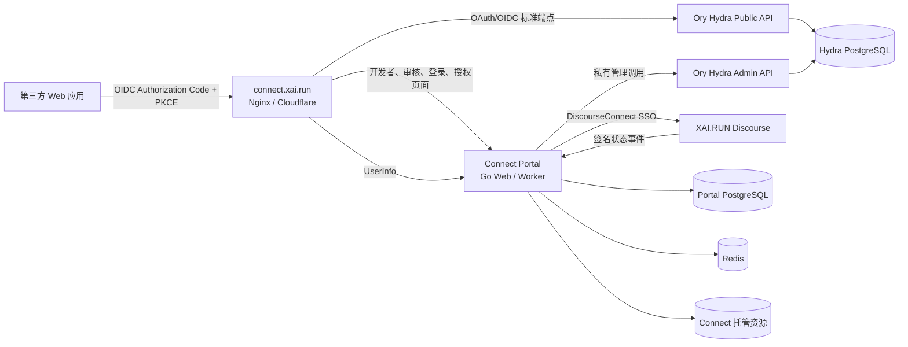
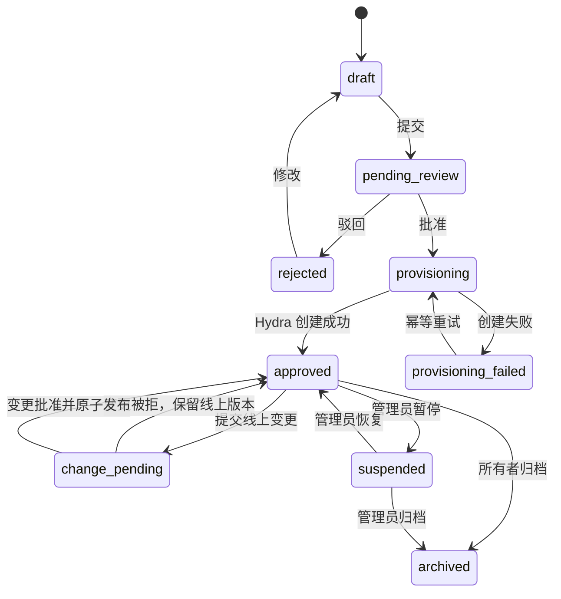

# XAI Connect 身份与应用接入平台设计

## 文档状态

- 日期：2026-08-28
- 状态：对话设计已确认，等待书面设计复核
- 公开入口：`https://connect.xai.run`
- 账号来源：XAI.RUN Discourse
- OAuth/OIDC 引擎：自托管 Ory Hydra
- Portal 技术栈：Go

## 1. 目标

建设一套独立的 XAI Connect 身份平台，使第三方网站能够使用现有 XAI.RUN Discourse 账号登录。平台同时向符合条件的论坛用户提供自助应用创建、域名验证、人工审核、Client 凭证管理、授权管理和接入文档。

平台的产品形态参考 LINUX DO Connect，但不复制其可能扩大数据暴露面的设计。Discourse 始终是唯一账号源；Connect 不提供独立注册、密码、找回密码或用户资料编辑功能。

第一版成功标准是：一个符合资格的论坛用户能够创建并提交应用，管理员审核通过后签发正式 Client ID/Secret，任意可登录的论坛用户能够通过标准 OIDC 授权码流程登录该应用，并且第三方只能取得本设计明确允许的最小资料集。

## 2. 已确认的产品决策

| 决策 | 结论 |
|---|---|
| 开发者准入 | 普通用户需 Discourse 信任等级 TL1 及以上；`connect-admins` 成员可绕过 TL1，所有用户都必须账号正常且未被禁言 |
| 应用创建 | 用户自助创建并提交人工审核 |
| 凭证开放方式 | 不设置测试模式；审核通过后直接签发正式凭证并向全部用户开放 |
| 客户端类型 | 第一版仅支持拥有服务端的保密 Web Client |
| 身份源 | Discourse 是唯一账号源；Connect 仅保存映射、会话和业务数据 |
| 部署边界 | Connect 独立部署，不把 OAuth 服务写入 Discourse 核心 |
| 协议引擎 | Ory Hydra |
| Portal 后端 | Go 单体应用，服务端渲染页面 |
| 用户资料 | 唯一 ID、用户名、昵称、头像、信任等级、活跃状态、禁言状态 |
| 不提供资料 | 邮箱、群组、外部账号、管理员身份、Discourse API Key |
| Client Secret | 可以再次明文查看；数据库中必须加密存储，不得裸存 |
| Token 策略 | 使用较长、后台可配置的生命周期；仍保留撤销与轮换机制 |

## 3. 范围

### 3.1 第一版包含

- DiscourseConnect 登录适配。
- OIDC Authorization Code Flow。
- PKCE S256、ID Token、Access Token 和可选 Refresh Token。
- OIDC Discovery、JWKS、UserInfo 和 Token 撤销。
- 开发者中心、应用创建、域名验证和人工审核。
- Client ID/Secret 生成、查看、重置和安全审计。
- 用户授权确认、授权记忆和授权撤销。
- 管理员审核、驳回、暂停、恢复和应用所有权转移。
- Discourse 用户状态同步和应用状态同步。
- 结构化日志、指标、审计、备份与恢复验证。

### 3.2 第一版不包含

- 邮箱、论坛群组和论坛 API 权限。
- SPA、移动端和桌面端客户端。
- Implicit、Password、Client Credentials、Device Code 等授权模式。
- OIDC Dynamic Client Registration。
- 自动审核或免审核应用。
- 多人共同管理一个应用。
- 向第三方应用主动推送用户封禁事件。
- 应用市场、计费、配额售卖和应用使用统计产品。
- 面向开发者的测试凭证、测试租户或测试用户模式。

## 4. 总体架构



### 4.1 Connect Portal

Connect Portal 是一个 Go 单体应用，同一代码库提供 Web 与 Worker 两种进程角色。它负责：

- DiscourseConnect 登录和本地 Connect Session。
- Discourse 用户到 Connect `sub` 的映射。
- 开发者准入、应用资料和版本状态机。
- 域名验证和人工审核。
- Hydra 登录挑战、授权挑战和 Client 生命周期管理。
- 用户授权页面、已授权应用页面和 UserInfo。
- Client Secret 加密、再次显示和重置。
- 状态同步、Outbox、后台任务和审计。

Portal 使用 Go 标准库 `net/http` 作为 HTTP 基础，采用服务端渲染页面和少量渐进增强 JavaScript，不建立独立的 Node/SPA 前端工程。数据访问采用 PostgreSQL 的显式 SQL 和类型安全查询生成方式。

### 4.2 Ory Hydra

Hydra 只负责 OAuth 2.0/OIDC 协议、授权码、Token、PKCE、签名密钥、Discovery 和 Client 协议数据。Hydra 不保存 XAI.RUN 密码，也不承担论坛用户管理。

Hydra Public API 通过 `connect.xai.run` 暴露；Hydra Admin API 只存在于容器私网，不绑定公网端口，不经过 Cloudflare，也不允许浏览器调用。

Hydra 镜像版本与 Go SDK 版本必须同时锁定。升级前必须运行 Client CRUD、Login/Consent、Token、Refresh、Revoke 和 UserInfo 契约测试。

### 4.3 Discourse 与身份薄插件

Discourse 继续负责注册、密码、邮箱验证、二步验证、账号停用和论坛资料。Connect 不直接连接 Discourse 数据库。

DiscourseConnect Provider 提供登录签名。一个独立的 `discourse-connect-identity` 薄插件仅提供以下补充能力：

- 返回白名单用户状态：Discourse 用户 ID、用户名、昵称、头像、信任等级、活跃状态、禁言状态。
- 返回仅供 Portal 授权使用的 `connect_reviewer`、`connect_admin` 布尔值；它们由指定论坛群组派生，但不返回任意群组列表。
- 在用户停用、恢复、禁言、解除禁言或信任等级变化时发送签名事件。
- 支持 Connect 对少量近期活跃用户执行只读状态对账。

插件不得提供通用管理员 API，不得返回邮箱、外部账号、任意群组列表、API Key 或任意查询字段。Reviewer/Admin 布尔值仅用于 Connect 后台访问控制，绝不进入 OIDC Token 或 UserInfo。服务间请求使用独立密钥签名，并校验时间戳、请求 ID 和重放窗口。

### 4.4 数据存储

- Portal 与 Hydra 使用独立逻辑数据库或独立 schema、独立数据库角色。
- 两者均不得复用 Discourse 业务数据库账号。
- Redis 仅保存 Connect Session、nonce、限流计数和短期任务协调数据。
- 永久业务状态、审核结果、授权和审计必须保存在 PostgreSQL。
- 应用 Logo 由 Connect 接收、校验、重新编码并托管，不在登录或授权页直接加载开发者控制的远程图片。

## 5. 身份模型

### 5.1 唯一账号源

用户不能在 Connect 注册账号、设置密码、找回密码或修改论坛资料。访问 Connect 时：

1. Portal 检查 Connect Session。
2. 没有有效 Session 时，跳转到 DiscourseConnect Provider。
3. Discourse 完成登录或复用现有论坛登录状态。
4. Discourse 返回 HMAC-SHA256 签名身份载荷。
5. Portal 验证签名、nonce、返回地址和账号状态，然后建立 Connect Session。

论坛用户天然是 Connect 用户；普通用户达到 TL1 且账号正常、未被禁言即可创建和提交应用，`connect-admins` 成员在账号正常且未被禁言时可绕过 TL1。

### 5.2 Connect 用户映射

Connect 为每个首次登录的 Discourse 用户创建内部映射：

```text
connect_users
├─ id
├─ subject_id              对外稳定、不可变的 OIDC sub
├─ discourse_user_id       仅内部使用
├─ username_snapshot
├─ name_snapshot
├─ avatar_snapshot
├─ trust_level_snapshot
├─ active
├─ silenced
├─ status_synced_at
├─ created_at
└─ updated_at
```

`subject_id` 是全平台稳定的公开 subject，在不同第三方应用间保持一致，但不能直接使用 Discourse 数据库主键。Discourse 用户被删除后，该 `subject_id` 永久保留为已删除状态且不得重新分配。

### 5.3 状态语义

- `active=false`、账号停用或封禁：不能开始新的 Connect 登录或授权。
- `silenced=true`：仍允许登录第三方应用，但 UserInfo 明确返回禁言状态。
- 开发者信任等级降至 TL1 以下：不能创建、提交或重新提交应用；已经上线的应用不自动下线。
- `connect-admins` 成员即使低于 TL1，仍可在账号正常且未被禁言时创建、提交和重新提交应用。
- 开发者被禁言：仍可作为普通用户登录第三方应用，但暂停创建、提交和修改应用；已经上线的应用不自动下线。
- 应用所有者被封禁：冻结其 Portal 管理权限并通知管理员，现有应用不自动停机。

## 6. 应用创建、审核与发布

### 6.1 开发者资格和数量限制

- 信任等级 TL1 及以上，或属于 `connect-admins` 群组。
- 账号活跃、未封禁、未禁言。
- 默认每个开发者最多拥有 3 个“待审核、变更待审核或已上线”应用。
- 管理员可对指定用户调整数量限制，所有调整必须记录审计。
- 第一版每个应用只有一个所有者；管理员可以转移所有权。

### 6.2 申请资料

创建应用必须提供：

- 应用名称、唯一 slug、上传到 Connect 的 Logo 和简介。
- 应用主页。
- 隐私政策地址。
- 开发者联系方式。
- 一个或多个 OAuth 回调地址。
- 用户资料用途说明。
- 申请使用的 Scope；`offline_access` 必须单独说明长期访问的必要性。

### 6.3 域名与回调验证

- 回调地址采用完整字符串精确匹配。
- 只允许 HTTPS。
- 不允许通配符、IP、localhost、URL Fragment 或开放重定向器。
- 回调地址必须属于应用所有者已验证的域名。
- 应用主页与隐私政策也必须位于已验证域名。
- 域名可通过 DNS TXT 或固定的 `/.well-known/` 验证文件完成所有权验证。
- 域名验证 Token 必须随机生成、设置有效期并可手动轮换。

### 6.4 状态机



应用处于草稿、待审核或驳回状态时，不创建 Hydra Client，也不签发凭证。审核通过后先进入 `provisioning`；只有 Hydra Client 创建、Secret 加密保存和 Portal 映射全部成功，应用才进入 `approved`。

Portal 使用数据库事务与 Outbox 驱动 Hydra 调用。重复执行同一 provisioning 任务必须幂等，不能创建多个 Hydra Client。

### 6.5 人工审核

审核员来自 Discourse `connect-reviewers` 群组，管理员来自 `connect-admins` 群组。审核内容至少包含：

- 开发者资格和应用用途。
- Logo、名称和品牌冒用风险。
- 主页和隐私政策是否可访问且内容一致。
- 域名所有权和回调地址安全性。
- 用户资料用途是否符合最小必要原则。
- 所申请 Scope 是否与用途一致，尤其是 `community` 和 `offline_access`。

普通审核员不能审核自己拥有的应用；`connect-admins` 成员可以审核所有应用，包括自己拥有的应用。批准、驳回、暂停、恢复和管理员越权操作必须填写理由并记录审计。

### 6.6 上线后变更

应用名称、Logo、简介、主页、隐私政策、资料用途、域名或回调地址发生变化时，创建新的待审核版本；当前线上版本继续服务。变更通过后，Portal 先更新 Hydra Client，再原子切换 Portal 的已发布版本。

Client Secret 查看和重置不触发应用重新审核。第一版只维护一个有效 Client Secret；重置成功后旧 Secret 立即失效，并向所有者显示明确的生产影响确认。

## 7. OAuth 2.0 与 OpenID Connect 契约

### 7.1 支持能力

第一版仅支持：

- `response_type=code`
- `grant_type=authorization_code`
- 可选 `grant_type=refresh_token`
- 保密 Web Client
- `client_secret_basic`
- PKCE `S256`

所有授权请求必须携带 PKCE `code_challenge`，Token 请求必须携带匹配的 `code_verifier`。OIDC 客户端还必须使用并验证 `nonce`；第三方必须使用 `state` 或等价机制绑定浏览器会话。

### 7.2 公开端点

```text
GET  /.well-known/openid-configuration
GET  /.well-known/jwks.json
GET  /oauth2/auth
POST /oauth2/token
POST /oauth2/revoke
GET  /userinfo
POST /userinfo
```

Hydra 提供 Discovery、JWKS、Authorization、Token 和 Revoke。`/userinfo` 由 Connect Portal 作为受保护资源端点提供：Portal 通过私有 Hydra 接口验证 opaque Access Token，再检查用户和应用当前状态后返回最新允许字段。Discovery 中的 `userinfo_endpoint` 仍为同一公开地址。

Hydra 的动态客户端注册接口不得通过公网暴露。所有 Client 只能由 Portal 在审核通过后通过私有 Admin API 创建。

### 7.3 Scope 与 Claim

第一版 Scope：

- `openid`：OIDC 身份标识。
- `profile`：`sub`、`preferred_username`、`name`、`picture`。
- `community`：`trust_level`、`active`、`silenced`。
- `offline_access`：允许签发 Refresh Token，必须在授权页单独说明。

UserInfo 示例：

```json
{
  "sub": "usr_稳定且不可变的Connect标识",
  "preferred_username": "论坛用户名",
  "name": "论坛昵称",
  "picture": "https://论坛头像地址",
  "trust_level": 1,
  "active": true,
  "silenced": false
}
```

任何情况下都不得返回邮箱、群组、外部账号、管理员身份、Moderator 身份、Discourse API Key 或未列入本设计的用户字段。UserInfo 只返回本次 Token 实际获批 Scope 对应的 Claim。

### 7.4 Token 和会话生命周期

以下为后台可配置的第一版默认值：

| 项目 | 默认值 | 规则 |
|---|---:|---|
| Authorization Code | 10 分钟 | 单次使用；成功或失败后失效 |
| ID Token | 1 小时 | 仅用于证明认证事件 |
| Access Token | 24 小时 | 用于 UserInfo |
| Refresh Token 空闲期 | 180 天 | 每次有效使用后重新计算 |
| Refresh Token 绝对期限 | 1 年 | 到期后必须重新授权 |
| Connect Session 滑动期 | 30 天 | 活跃使用时续期 |
| Connect Session 绝对期限 | 90 天 | 到期后重新经过 Discourse 登录 |
| 用户授权记录 | 无固定期限 | 用户撤销、应用暂停或范围变化时失效 |

Refresh Token 每次使用后轮换；检测到已轮换 Token 被再次使用时，撤销同一 Token Family。开发者不能自行设置永不过期 Token。

第三方应用必须使用 ID Token 建立自己的本地 Session，不能把 Connect Access Token 直接当作本地登录 Cookie。第三方本地 Session 不受 Connect 直接控制，这一限制必须写入接入文档。

### 7.5 用户授权

- 用户首次登录每个应用时必须看到应用名称、Logo、已验证域名、隐私政策和共享字段。
- 同一应用、同一已发布版本和同一 Scope 集合可以记住授权。
- 资料范围或数据用途变化后必须重新授权。
- 用户可以在“已授权应用”页面查看并撤销授权。
- 撤销后 Portal 删除授权记录并要求 Hydra 撤销 Refresh Token 和相关授权会话。
- 已签发 Access Token 可能继续存在至最长 24 小时，但 `/userinfo` 会实时检查用户和应用状态并拒绝已撤销访问。

## 8. Client Secret 管理

Client Secret 可以由应用所有者再次明文查看，但必须满足：

- Secret 由密码学安全随机源生成。
- Portal 使用 AES-256-GCM 或等价 AEAD 加密后保存，数据库中不得出现明文。
- 每条密文保存独立 nonce 和密钥版本，并把应用 ID、Hydra Client ID 作为 Associated Data。
- 主密钥通过 Docker Secret、受控密钥文件或外部密钥服务注入，不写入数据库、镜像、源码或普通环境导出文件。
- 数据库备份与主密钥备份分离保管。
- 页面默认显示掩码；所有者完成近期敏感操作确认后才能显示明文。
- 敏感操作优先使用 DiscourseConnect `require_2fa`；未配置二步验证的账号至少重新完成签名 SSO 往返并校验短期操作 Token。
- 明文只存在于当前响应，不进入日志、缓存、指标、审计正文或错误上报。
- 只有应用所有者可以查看；管理员只能触发重置，不能查看现有 Secret。
- 查看、复制和重置均写入不含凭证正文的审计事件。

主密钥轮换通过带版本的后台任务逐条解密并重新加密。任务必须支持中断恢复和幂等执行。

## 9. Portal 数据模型

核心实体：

- `connect_users`：Discourse 用户映射和状态快照。
- `applications`：应用所有者、当前状态、线上版本和 Hydra 映射。
- `application_versions`：每次申请和变更的不可变资料快照。
- `verified_domains`：域名、验证方式、Token、状态和验证时间。
- `application_reviews`：审核人、决定、理由和时间。
- `application_assets`：经过校验和重新编码的应用 Logo 元数据。
- `encrypted_client_secrets`：密文、nonce、密钥版本和最后查看/轮换时间。
- `user_consents`：用户、应用、版本、Scope、授权和撤销时间。
- `outbox_events`：待执行的 Hydra 与 Discourse 集成动作。
- `audit_events`：操作者、对象、动作、结果、请求关联 ID 和时间。

关键约束：

- `connect_users.subject_id` 与 `discourse_user_id` 分别唯一。
- 一个应用只能有一个当前线上版本。
- 同一已验证域名不能在未处理所有权争议时被多个无关所有者重复认领。
- Hydra Client ID 与 Portal Application 一一对应。
- Outbox 使用业务幂等键避免重复创建、撤销或恢复 Client。
- 审计记录只追加，不允许通过普通业务接口修改。

## 10. 安全控制

### 10.1 会话与请求

- Connect Session 使用至少 256 bit 随机 ID，服务端存储。
- Cookie 使用 `Secure`、`HttpOnly`、`SameSite=Lax` 和 `__Host-` 前缀。
- 登录后和权限提升后轮换 Session ID。
- 所有状态变更表单启用 CSRF Token。
- DiscourseConnect nonce 单次使用并设置短期 TTL。
- HMAC 验签使用常量时间比较。
- 返回地址只允许预配置的 Connect 地址，不接受任意 URL。

### 10.2 浏览器安全

- CSP 默认只允许同源脚本、样式、图片和连接；第三方资源必须经过显式评审。
- 设置 `frame-ancestors 'none'`、`X-Content-Type-Options: nosniff` 和严格 Referrer Policy。
- OAuth 授权页不得被第三方 iframe 嵌入。
- 应用 Logo 上传后必须校验真实媒体类型、像素尺寸和大小，并重新编码为允许的静态图片格式；授权页只加载 Connect 托管副本。

### 10.3 OAuth 安全

- 精确匹配 Redirect URI。
- 强制 Authorization Code 与 PKCE S256。
- Authorization Code 单次使用并绑定 Client、Redirect URI 和 PKCE Challenge。
- 拒绝开放重定向、未知 Scope、未知 Audience 和未审核 Client。
- 不在 URL、浏览器日志或错误页中显示 Token 与 Secret。
- Access Token 默认使用 opaque 策略；第三方不能依赖其内部格式。

### 10.4 权限与审计

- 所有对象查询都同时校验当前用户与应用所有权，禁止仅凭资源 ID 访问。
- 普通 Reviewer 不能审核自己的应用；Admin 可以审核所有应用。
- Admin 高风险操作要求填写理由。
- Secret 查看、权限变化、审核和暂停操作需要额外限流。
- 审计默认保留至少 365 天；审核决定在应用归档后至少再保留 365 天。

## 11. 状态同步与故障语义

### 11.1 Discourse 状态事件

薄插件使用 Outbox 发送签名事件，事件包含事件 ID、用户 ID、事件类型、状态、发生时间和签名。Connect 使用事件 ID 幂等消费并拒绝超出允许时间窗口的无效重放。

Connect 在用户登录时同步一次状态，并对近期活跃用户进行周期性对账。事件用于快速同步，周期对账用于修复事件丢失。

### 11.2 用户停用

收到账号停用事件后：

1. 标记 Connect 用户不可登录。
2. 删除其 Connect Session。
3. 撤销 Hydra Refresh Token 和授权会话。
4. `/userinfo` 立即拒绝其 Access Token。

已经被第三方应用转换成本地 Session 的登录状态无法由 Connect 强制删除。第一版不提供第三方封禁 Webhook。

### 11.3 应用暂停

暂停应用时：

1. Portal 先把应用标记为 `suspended`，Login/Consent 和 UserInfo 立即拒绝。
2. 后台任务通过 Hydra 管理接口撤销 Client 相关授权并阻止 Token 刷新。
3. 任务失败自动重试并持续告警。
4. 恢复时根据 Portal 已发布版本幂等重建或恢复 Hydra Client。

### 11.4 依赖故障

- Discourse 不可用：不能建立新的 Connect 身份；已有 Session 只有在最近 15 分钟内成功同步过账号状态时可以继续完成授权，超过后失败关闭。
- Hydra 不可用：授权和 Client provisioning 返回统一临时不可用错误，不产生半完成状态。
- Portal PostgreSQL 不可用：登录、审核、授权和 UserInfo 失败关闭；已经签发的 Token 仍按其自身生命周期存在。
- Redis 不可用：新登录、敏感操作和依赖 nonce 的流程失败关闭。
- Worker 中断：Outbox 任务保留在 PostgreSQL，恢复后幂等继续。

OAuth 端点返回标准错误码；Portal 页面显示不含内部细节的用户可读错误和请求关联 ID。

## 12. 产品界面

### 12.1 用户与开发者页面

- Connect 首页与接入文档。
- 使用 Discourse 登录。
- 我的应用列表。
- 创建和编辑应用。
- 域名验证。
- 提交审核、查看状态和驳回理由。
- 应用详情、Client ID、Secret 查看与重置。
- OAuth 授权确认页。
- 已授权应用列表和撤销入口。

### 12.2 管理员页面

- 待审核队列和筛选。
- 应用版本对比、域名状态和资料用途检查。
- 批准、驳回、暂停、恢复和归档。
- 所有权转移和数量限制调整。
- 用户、应用、授权、Secret 操作和系统安全审计。

所有页面都使用 Discourse 身份。Connect 不出现密码输入、独立注册或找回密码入口。

## 13. 可观测性与运维

- JSON 结构化日志，统一请求关联 ID。
- 日志中间件自动清除 Cookie、Authorization、Token、授权码和 Secret。
- 指标至少覆盖登录成功率、授权成功率、Hydra 错误、Discourse 同步延迟、Outbox 积压、审核耗时、Secret 查看失败和可疑重放。
- Portal、Worker、Hydra、PostgreSQL 和 Redis 提供独立健康检查。
- 告警覆盖持续登录失败、Hydra 管理调用失败、状态事件验签失败、重复 nonce、Token 撤销积压和备份失败。
- Portal PostgreSQL、Hydra PostgreSQL、加密主密钥和配置分别备份，并定期执行恢复演练。
- Hydra Public API 通过现有 Nginx/Cloudflare 暴露；Admin API 仅走 Docker 私网。
- 反向代理不得缓存 Authorization、Token、Revoke、UserInfo、登录、授权或 Secret 响应，并必须保留 Hydra/Portal 的 `Cache-Control: no-store`。
- 生产与预发布环境使用独立数据库、密钥、DiscourseConnect Secret 和域名。预发布环境用于平台自身验证，不向应用开发者提供测试凭证。

## 14. 测试策略

### 14.1 单元测试

- TL1 开发者资格和账号状态规则。
- 应用与应用版本状态机。
- 域名、HTTPS 和 Redirect URI 校验。
- Scope 到 Claim 的映射。
- Secret 加密、解密、Associated Data 和密钥轮换。
- 审核权限、应用所有权和 Reviewer 自审限制。
- Token 生命周期配置校验。

### 14.2 集成与契约测试

- 使用真实 PostgreSQL、Redis 和锁定版本 Hydra 完整运行。
- 覆盖 Client 创建、更新、删除、登录挑战、授权挑战、授权码交换、Refresh、Revoke 和 UserInfo。
- 覆盖 DiscourseConnect HMAC、nonce、防重放和状态事件。
- 每次 Hydra 或 SDK 升级都执行双向契约测试。

### 14.3 安全测试

- Redirect URI 模糊匹配和开放重定向攻击。
- 授权码、nonce、state 和 Refresh Token 重放。
- 缺失或错误 PKCE verifier。
- CSRF、越权查看/修改应用、越权查看 Secret。
- 普通 Reviewer 自审、普通用户访问管理员页面和所有权伪造；Admin 审核操作仍需记录审计。
- 日志、错误页、指标和追踪中的凭证泄漏扫描。

### 14.4 浏览器端到端测试

- TL0 用户不能创建应用，TL1 用户可以创建。
- 域名验证、提交、驳回、修改、批准和 provisioning。
- 审核通过后直接面向全部用户开放。
- 首次授权、记住授权、重新授权和撤销。
- Secret 重新认证、明文查看和重置。
- 上线变更审核期间旧版本持续可用。
- 应用暂停和用户停用后的拒绝行为。

### 14.5 运维验证

- Portal 与 Hydra 数据库备份恢复。
- Secret 主密钥恢复与轮换。
- Hydra/SDK 升级和回滚。
- Discourse、Hydra、Redis、数据库和 Worker 故障注入。
- Outbox 重复执行和进程中断后的幂等恢复。

## 15. 验收标准

第一版必须同时满足：

1. Discourse 是唯一账号源，Connect 不保存或处理用户密码。
2. TL1 且账号正常、未禁言的普通用户，以及账号正常、未禁言的 `connect-admins` 成员，可以创建并提交应用。
3. 未审核应用没有 Hydra Client 和正式凭证。
4. 审核通过后正式 Client 创建成功，应用立即向全部可登录论坛用户开放。
5. 应用所有者可以在近期敏感操作确认后再次查看明文 Client Secret。
6. 第三方服务端可以依据 Discovery 完成 OIDC Authorization Code + PKCE 登录。
7. UserInfo 只能返回本设计批准的最小字段，任何禁止字段均不可出现。
8. 用户可以查看并撤销授权；应用暂停或账号停用能阻止新的登录与 UserInfo。
9. Hydra Admin API、Discourse 插件内部接口和 Secret 主密钥均不暴露公网。
10. 关键流程具备自动化测试、审计、指标、告警、备份和恢复证据。

## 16. 参考资料

- LINUX DO Connect：<https://wiki.linux.do/Community/LinuxDoConnect>
- Discourse 作为身份提供方：<https://meta.discourse.org/t/use-discourse-as-an-identity-provider-sso-discourseconnect/32974>
- Ory Hydra：<https://www.ory.com/hydra>
- Ory Hydra Go SDK：<https://github.com/ory/hydra-client-go>
- OAuth 2.0 Security Best Current Practice：<https://www.rfc-editor.org/info/rfc9700/>
- OpenID Connect Core 1.0：<https://openid.net/specs/openid-connect-core-1_0.html>
