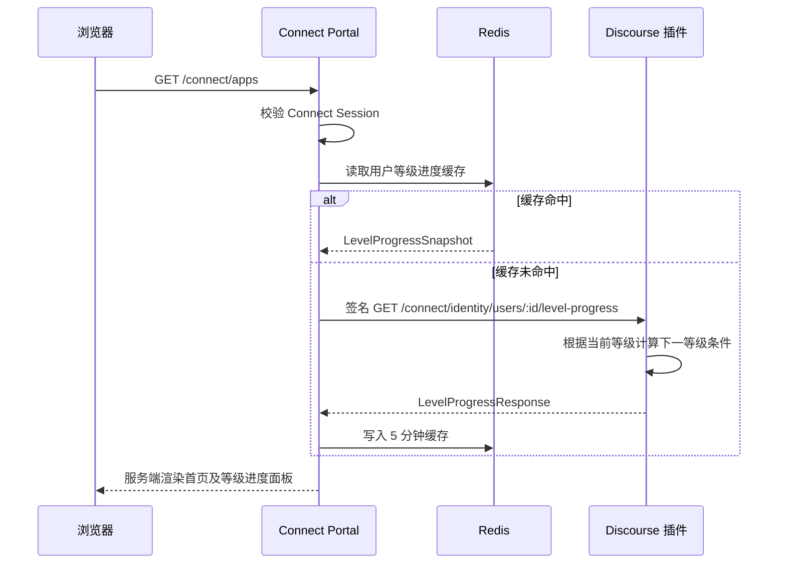

# XAI Connect 首页用户等级进度展示设计

## 文档状态

- 日期：2026-09-02
- 状态：对话设计已确认，等待书面设计复核
- 目标页面：`GET /connect/apps` 首页
- 账号源：XAI.RUN Discourse

## 1. 目标

在 XAI Connect 现有首页增加一块“用户等级进度”内容，展示登录用户的当前信任等级、当前等级的下一等级，以及达到下一等级所需的条件和当前进度。

本需求只增加首页展示内容，不调整 Portal 的整体结构：保留现有顶部栏、侧边栏、应用统计卡片、应用列表和右侧接入提示，不增加新的导航入口，不拆分首页模板，不引入 SPA 或浏览器端请求。

成功标准：

1. 用户进入首页时，可以看到当前等级和下一等级。
2. 用户可以逐项看到达到下一等级所需的条件、当前值、目标值和达成状态。
3. 条件由 Discourse 根据当前站点配置和官方等级规则计算，Portal 不复制或猜测等级规则。
4. Discourse 或等级进度接口暂时不可用时，应用列表仍可正常展示，并给出清晰的同步失败提示。

## 2. 已确认的产品决策

| 决策 | 结论 |
|---|---|
| 展示位置 | 现有 `/connect/apps` 首页内容区，作为新增面板；不改变页面骨架 |
| 数据来源 | Discourse 实时计算后由 Portal 服务端同步 |
| 接口语义 | 通用用户等级进度，不是 TL3 专用统计接口，也不是原始统计接口 |
| 目标等级 | 当前等级的下一等级；当前等级为最高等级时不再提供目标等级 |
| 条件归属 | `requirements` 始终表示“达到目标等级”的条件，不表示已经达到当前等级的条件 |
| 计算位置 | Discourse 插件计算；Portal 只校验、缓存和渲染 |
| 浏览器访问 | 浏览器不直接访问 Discourse 进度接口；仅由 Portal 使用 HMAC 服务请求调用 |
| 失败处理 | 进度同步失败不阻断首页应用列表，面板显示降级状态 |
| 数据持久化 | 第一版不新增 PostgreSQL 表；使用 Redis 短期缓存 |

## 3. 方案选择

### 方案 A：Discourse 计算等级进度，Portal 展示（采用）

新增一个受 HMAC 保护的 Discourse 接口。接口根据用户的实际信任等级，计算下一等级和对应条件，返回稳定的条件键、当前值、目标值、比较方式和达成状态。Portal 在首页请求该接口并用 Redis 缓存短时间结果。

优点是等级规则只有一个权威实现，能够复用 Discourse 的站点设置、`Promotion` 和 `TrustLevel3Requirements`，升级 Discourse 时也能集中适配。Portal 只负责展示，不会出现“Discourse 已升级而 Connect 仍使用旧阈值”的不一致。

### 方案 B：Discourse 只返回原始统计，Portal 自己计算

需要在 Go 中复制 TL1、TL2、TL3 的规则、站点设置含义和特殊条件，既增加接口暴露面，也会让 Portal 与 Discourse 的规则长期漂移。不采用。

### 方案 C：Discourse 通过事件持续推送等级进度快照

等级进度包含访问、阅读、点赞等持续变化的数据，事件频率和载荷会明显增加，仍需要处理事件丢失、补偿和站点规则变化。不作为第一版同步方式；状态事件只用于清理缓存，首页请求按短 TTL 获取最新进度。

## 4. 系统边界与数据流



Portal 通过现有的 Connect 用户映射取得 Discourse 用户 ID。进度请求与现有用户状态请求使用相同的 HMAC 时间戳、随机 nonce 和重放保护机制，但使用独立路径和独立响应模型。

## 5. Discourse 接口契约

### 5.1 请求

```text
GET /connect/identity/users/:id/level-progress
```

请求必须携带现有的：

- `X-Connect-Timestamp`
- `X-Connect-Nonce`
- `X-Connect-Signature`

签名的 canonical request 仍然是 `method + path + timestamp + nonce + body`。GET 请求 body 为空。接口只允许通过已配置的 Connect 共享密钥调用，并复用现有签名验证和 nonce 重放保护。

现有 `GET /connect/identity/users/:id` 的响应保持不变，避免破坏已有身份同步契约。

### 5.2 响应

```json
{
  "schema_version": 1,
  "discourse_id": 42,
  "current_level": {
    "id": 2,
    "key": "member",
    "label": "成员"
  },
  "next_level": {
    "id": 3,
    "key": "regular",
    "label": "常规"
  },
  "promotion_mode": "automatic",
  "requirements_met": false,
  "requirements": [
    {
      "key": "days_visited",
      "label": "访问天数",
      "group": "activity",
      "scope": "rolling_period",
      "period_days": 100,
      "current": 40,
      "target": 50,
      "operator": "at_least",
      "unit": "days",
      "met": false
    }
  ],
  "blocking_conditions": [
    {
      "key": "not_silenced",
      "label": "账号未被禁言",
      "met": true
    }
  ],
  "generated_at": "2026-09-02T08:00:00Z"
}
```

字段约定：

| 字段 | 约定 |
|---|---|
| `schema_version` | 当前为 `1`；Portal 不接受未知版本 |
| `discourse_id` | 必须与请求路径中的用户 ID 一致 |
| `current_level` | Discourse 当前实际等级，不在 Portal 重新计算 |
| `next_level` | 当前等级加一；当前等级为 4 时为 `null` |
| `promotion_mode` | `automatic`、`manual`、`locked` 或 `none` |
| `requirements_met` | 自动升级目标返回布尔值；手动、锁定或无目标时为 `null` |
| `requirements` | 达到 `next_level` 的数值条件；每项都包含当前值、目标值、比较方式和达成状态 |
| `blocking_conditions` | 账号状态、处罚或手动锁定等不能用普通数值阈值表达的条件 |
| `scope` | `account_lifetime`、`rolling_period` 或 `all_time` |
| `period_days` | 仅对滚动周期条件设置；其他条件为 `null` |
| `operator` | 第一版仅使用 `at_least`、`at_most`、`equals` |
| `unit` | `count`、`days` 或 `minutes` |
| `generated_at` | Discourse 计算完成时间，用于诊断和页面辅助说明 |

接口只返回为展示下一等级所需的最小数据，不返回任意用户资料、群组、帖子标题、帖子内容、IP、API Key 或其他原始记录。

### 5.3 等级和模式语义

- 当前等级 0、1、2 时，目标分别为 1、2、3，通常返回 `automatic` 和对应条件。
- 当前等级 3 时，目标为 4；Discourse 的最高等级通常由管理员手动授予，因此返回 `promotion_mode: "manual"`、空条件列表和 `requirements_met: null`，Portal 展示“目标等级 4 需管理员授予”。
- 当前等级 4 时，`next_level: null`、`promotion_mode: "none"`，Portal 展示“当前已是最高等级”。
- 如果用户的当前等级被 `manual_locked_trust_level` 锁定，目标等级仍可返回当前等级的下一等级，但 `promotion_mode` 为 `locked`，不宣称用户可以通过这些条件自动升级。
- `current_level` 以用户当前实际等级为准；接口不为了展示而调用重新计算或改变用户等级。

## 6. 条件计算规则

Discourse 插件新增的进度序列化器按目标等级分派规则，但不把接口命名或响应限制为 TL3。

### 6.1 目标等级 1

复用 Discourse 当前 `Promotion.tl1_met?` 的规则和站点设置，至少包括：

- 进入话题数达到 `tl1_requires_topics_entered`。
- 阅读帖子数达到 `tl1_requires_read_posts`。
- 阅读时长分钟数达到 `tl1_requires_time_spent_mins`。
- 账号年龄达到同一时间要求。

每个条件单独输出，Portal 不只输出一个总布尔值。

### 6.2 目标等级 2

复用 Discourse 当前 `Promotion.tl2_met?` 的规则和站点设置，至少包括：

- 进入话题数。
- 阅读帖子数。
- 阅读时长。
- 账号年龄。
- 访问天数。
- 获赞数。
- 点赞数。
- 回复话题数。

条件的当前值来自 Discourse `UserStat` 及现有统计方法，目标值来自当前站点设置。

### 6.3 目标等级 3

复用 Discourse `TrustLevel3Requirements` 的当前计算结果，包含：

- 滚动周期内访问天数、回复话题数、浏览话题数和阅读帖子数。
- 全站累计浏览话题数和阅读帖子数。
- 滚动周期内点赞数、获赞数、获赞天数和获赞用户数。
- 被确认举报的帖子数和举报用户数上限。
- 未被禁言、未被封禁、近六个月无有效处罚等阻断条件。

动态阈值（例如按站点近期开启话题/帖子数和上限计算的目标值）必须使用 Discourse 计算出的实际 `min_*` / `max_*` 方法结果，不能只读取静态百分比设置。

### 6.4 条件标签

响应同时返回稳定 `key` 和面向用户的 `label`。`key` 用于测试和未来兼容，`label` 由插件的本地化资源提供；Portal 对其进行 HTML 转义后展示。Portal 不根据 TL3 的固定字段名称重新生成条件列表。

## 7. Portal 集成

### 7.1 身份包模型和客户端

在 `internal/identity` 增加独立的进度模型和客户端方法：

- `LevelProgressSnapshot`：对应已校验的响应。
- `LevelInfo`：等级 ID、稳定 key、显示 label。
- `LevelRequirement`：条件 key、label、分组、范围、当前值、目标值、比较方式、单位和达成状态。
- `LevelBlockingCondition`：阻断条件 key、label 和达成状态。
- `Client.FetchLevelProgress(ctx, discourseID)`：调用新路径、限制响应体大小、校验 schema、用户 ID、等级范围、目标等级关系、模式和值的合法性。
- `LevelProgressLookup`：按 Connect subject 查找用户映射并取得进度，避免 HTTP handler 直接依赖 Discourse ID。

进度模型与 `UserSnapshot`、`StatusSnapshot` 分离。现有身份状态刷新和 OIDC UserInfo 契约不因本功能增加统计字段。

### 7.2 缓存

新增一个 Redis 包装器实现 `LevelProgressLookup`：

- key：`connect:identity:level-progress:v1:<discourse_id>`。
- 成功响应缓存 5 分钟。
- 缓存内容为完整、已校验的 JSON 快照。
- Redis 读写失败或 Discourse 请求失败时返回错误，不把错误结果写入缓存。
- 首页 handler 捕获进度错误并继续渲染，不把等级进度故障升级为首页 500。
- 现有状态事件成功更新用户状态后，删除该用户的进度缓存；即使统计数据没有事件，也由 5 分钟 TTL 保证最终刷新。

第一版不把等级进度快照写入 PostgreSQL，也不把它放入 Connect Session 或 OIDC Token。

### 7.3 首页数据

仅在应用列表首页分支调用进度 lookup：

```text
GET /connect/apps
  ├─ 获取当前用户应用列表
  ├─ 获取共享 Layout 和当前状态
  ├─ 获取 LevelProgress（可失败）
  └─ 渲染现有 app-list 首页分支
```

应用详情分支、创建应用页、审核页和 OAuth 页面不增加该调用。

模板数据增加可选 `LevelProgress` 字段；缺失时使用 `Layout.TrustLevel` 保留当前等级的最小降级展示，并显示“等级条件暂时无法同步”。

## 8. 首页展示设计

在现有应用统计卡片之后、现有应用列表之前插入一个面板。该面板是内容增量，不改变 `.portal-shell`、`.portal-sidebar`、`.workspace-grid` 等现有布局结构和导航。

面板内容：

1. 标题“用户等级进度”。
2. 左侧或上方显示“当前等级”和等级名称。
3. 右侧或下方显示“目标等级”和等级名称；目标始终是当前等级的下一等级。
4. 显示“达到目标等级的条件”，按接口返回的 `group` 分组。
5. 每项显示条件标签、`current / target`、单位和进度条；`at_most` 条件使用“不超过目标”的文案和达成状态。
6. 阻断条件单独显示为已满足/未满足状态。
7. 显示数据计算时间或周期提示，例如“按最近 100 天数据计算”。
8. 目标为手动授予、最高等级或同步失败时，使用对应的说明状态，不伪造进度条。

建议的中文分组：`活跃程度`、`互动参与`、`合规与账号状态`。分组只是展示层，不参与等级计算。

响应中未知的条件分组或条件 key 仍然要安全显示，不因为新增条件导致模板报错；未识别单位使用原始数值和通用文案。

## 9. 错误处理与安全

### Discourse 端

- 用户不存在返回 404。
- 签名缺失、过期、错误或 nonce 重放返回与现有身份接口一致的 401/503 行为。
- 序列化器异常不能泄露 SQL、帖子内容或服务器内部路径。
- 只允许返回当前请求用户的等级进度，不接受查询条件、排序、分页或任意字段参数。

### Portal 端

- 校验 `discourse_id` 必须匹配已登录 Connect 用户映射，防止响应错配。
- 限制响应体大小，拒绝未知 schema 和异常大数量的条件项。
- 所有 label、key 和提示文本经 Go `html/template` 转义；不使用 `template.HTML`。
- 进度数据不进入日志、审计详情、浏览器缓存或 OIDC Claim。
- 失败时首页继续显示应用列表；当前等级可使用已有状态快照，条件区域显示同步失败。

## 10. 测试与验收

### Discourse RSpec

- 新接口要求正确 HMAC 签名，错误签名、过期请求和重放 nonce 被拒绝。
- 目标等级按 0→1、1→2、2→3 分别返回对应条件，不把响应固定为 TL3。
- 每个标准条件的当前值、目标值、比较方式和 `met` 值正确。
- TL3 动态阈值、处罚条件、禁言/封禁状态正确反映。
- 当前等级 3 返回目标 4 和 `manual` 模式；当前等级 4 返回无目标等级。
- 手动锁定用户返回 `locked` 模式。
- 旧用户状态接口的字段集合保持不变。
- 响应不包含群组、帖子内容、IP、API Key 等未授权字段。

### Go 测试

- 客户端构造新路径、签名请求、解析响应和拒绝非法响应。
- LevelProgressLookup 正确通过 subject 找到 Discourse ID，并拒绝身份错配。
- Redis 缓存命中、未命中、过期、Redis 故障和 Discourse 故障行为正确。
- 状态事件会清理对应等级进度缓存。
- 首页 handler 将成功进度传入模板；进度失败时仍返回 200 并显示降级提示。
- 详情页和其他页面不会触发等级进度请求。

### 模板和浏览器验收

- 现有首页导航、应用统计卡片、应用列表和右侧接入提示仍存在。
- 新面板在桌面和移动宽度下不溢出；不改变现有侧栏和网格结构。
- 条件项、进度条和阻断状态能被屏幕阅读器理解，颜色不是唯一状态表达方式。
- label 中包含 HTML 特殊字符时仍被安全转义。
- 通过浏览器检查已登录用户的当前等级、目标等级和条件展示。

## 11. 预计文件范围

### Discourse 插件

- `discourse-plugin/connect-identity/plugin.rb`：注册新路由和加载序列化器。
- `discourse-plugin/connect-identity/app/controllers/connect_identity/users_controller.rb`：新增等级进度 action。
- `discourse-plugin/connect-identity/lib/connect_identity/level_progress_serializer.rb`：封装目标等级和条件计算。
- `discourse-plugin/connect-identity/config/locales/server.zh_CN.yml`：增加条件标签和模式文案。
- `discourse-plugin/connect-identity/spec/requests/connect_identity_spec.rb`：增加独立接口契约测试。
- `discourse-plugin/connect-identity/README.md`：补充接口说明。

### Portal

- `internal/identity/provider.go`：增加进度模型和 lookup/provider 接口。
- `internal/identity/client.go`：增加签名进度请求。
- `internal/identity/level_progress.go`：实现映射、缓存和响应校验。
- `internal/identity/events.go`：状态事件成功后清理进度缓存。
- `internal/apps/http.go`：仅在首页取得可选进度数据。
- `internal/web/templates/app-list.html`：插入等级进度面板内容。
- `internal/web/static/portal.css`：增加面板和响应式条件项样式。
- 对应的 Go 单元测试和模板测试。

不新增数据库迁移，不修改 Portal 路由结构，不增加独立前端构建链，不修改现有身份状态 JSON 契约。

## 12. 实现前检查结论

- 目标是一个跨 Discourse 插件、Portal 客户端、缓存和首页模板的接口增量，按一个实现计划处理仍保持范围集中。
- 当前等级、目标等级和条件的职责已明确：Discourse 计算，Portal 展示。
- TL3 只是目标等级 3 的一种规则分支，接口和首页不会出现 TL3 专用命名。
- 目标等级 4 的手动授予语义已明确，不会生成虚假的自动升级条件。
- 同步失败的降级行为、隐私边界、缓存键和测试范围已明确，没有待定项。
